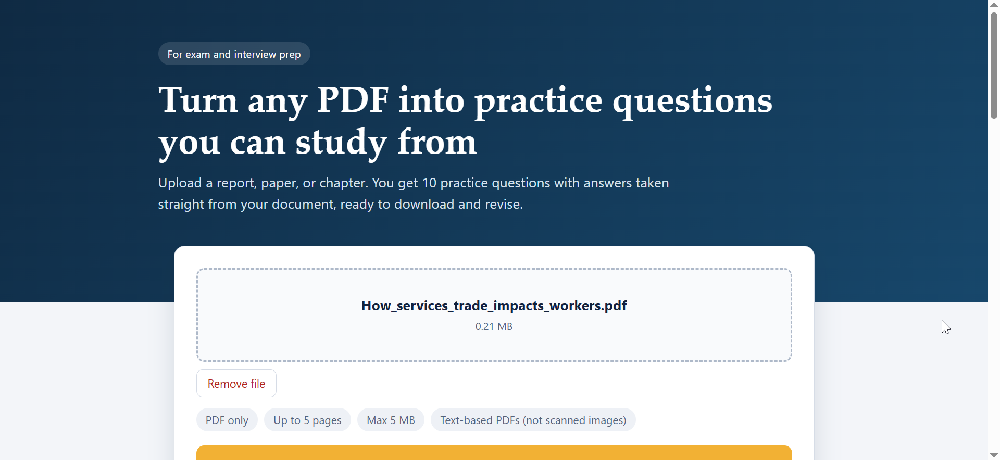
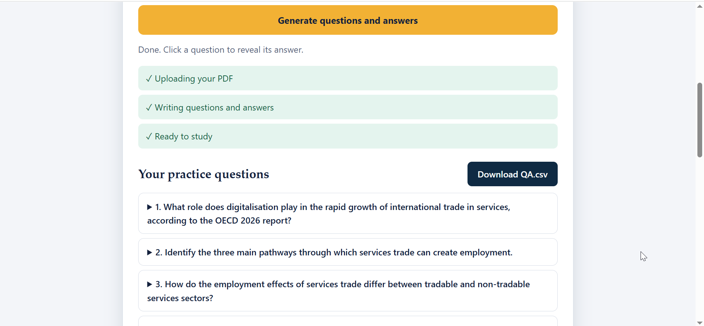
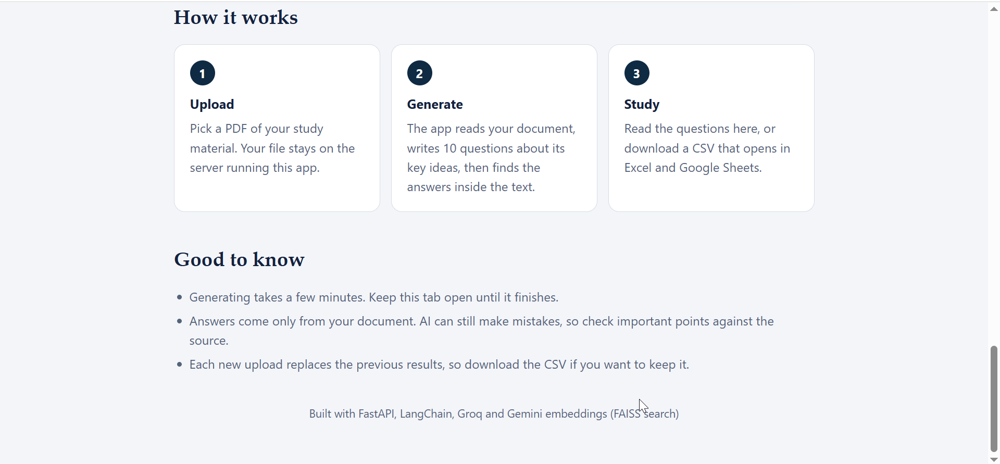

# LangChain PDF Q&A Generator

Generate question-answer pairs from any **social sciences PDF** using LangChain, Groq, Gemini embeddings, and FAISS.

Upload a PDF (a textbook chapter, research paper, or lecture notes) and get a set of questions with answers, grounded in the document's own content.

## Demo

### App overview



### Successful generation



### How it works



## Features

- Reads and splits social sciences PDFs into chunks
- Embeds chunks with Gemini embeddings and stores them in a FAISS vector store
- Uses a Groq-hosted LLM through LangChain to generate questions and answers from the retrieved context
- Runs locally with a simple setup

## Tech Stack

| Component | Tool |
|---|---|
| Framework | LangChain |
| LLM | Groq |
| Embeddings | Google Gemini |
| Vector store | FAISS |
| Language | Python 3.10 |

## How It Works

```
PDF  ->  Text chunks  ->  Gemini embeddings  ->  FAISS index  ->  Retrieved context  ->  Groq LLM  ->  Questions & answers
```

1. The PDF is loaded and split into overlapping chunks.
2. Each chunk is converted into an embedding and stored in FAISS.
3. Relevant context is retrieved and passed to the LLM.
4. The LLM generates questions and answers based on that context.

## How to Run

### 1. Clone the repository

```bash
git clone https://github.com/rayzzcoder/langchain-pdf-qa-generator.git
cd langchain-pdf-qa-generator
```

### 2. Create an environment

```bash
conda create -n interview python=3.10 -y
conda activate interview
```

### 3. Install requirements

```bash
pip install -r requirements.txt
```

### 4. Add your API keys

Create a `.env` file in the project root:

```
GROQ_API_KEY=your_groq_api_key
GOOGLE_API_KEY=your_gemini_api_key
```

Get keys from [Groq Console](https://console.groq.com) and [Google AI Studio](https://aistudio.google.com).

### 5. Run the project

```bash
# Replace with your actual command, e.g.:
# python app.py
# jupyter notebook
```

## Sample Data

The `data/` folder contains a few publicly available social sciences reports used for testing. You can also add your own PDFs there.

## Future Work

- Support for scanned PDFs (OCR)
- Difficulty levels and question types (short answer, MCQ)

## Author

**Raja Abdul Rafay**, BS IT, Quaid-i-Azam University
GitHub: [@rayzzcoder](https://github.com/rayzzcoder)
